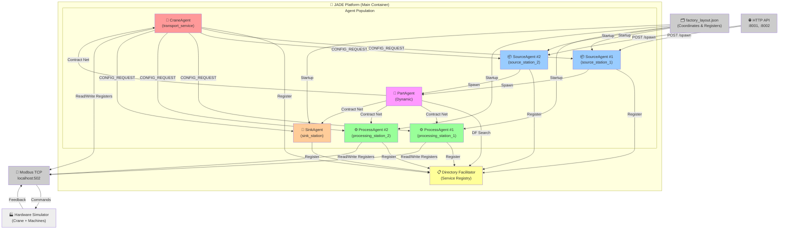
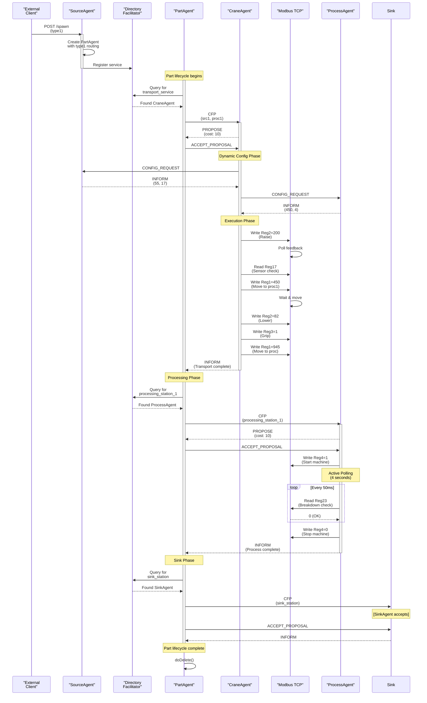
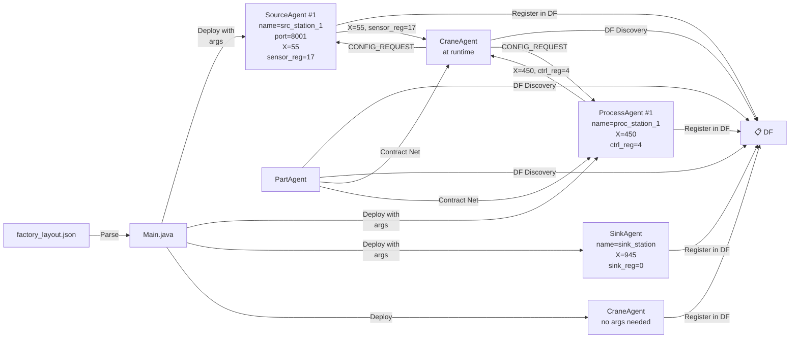
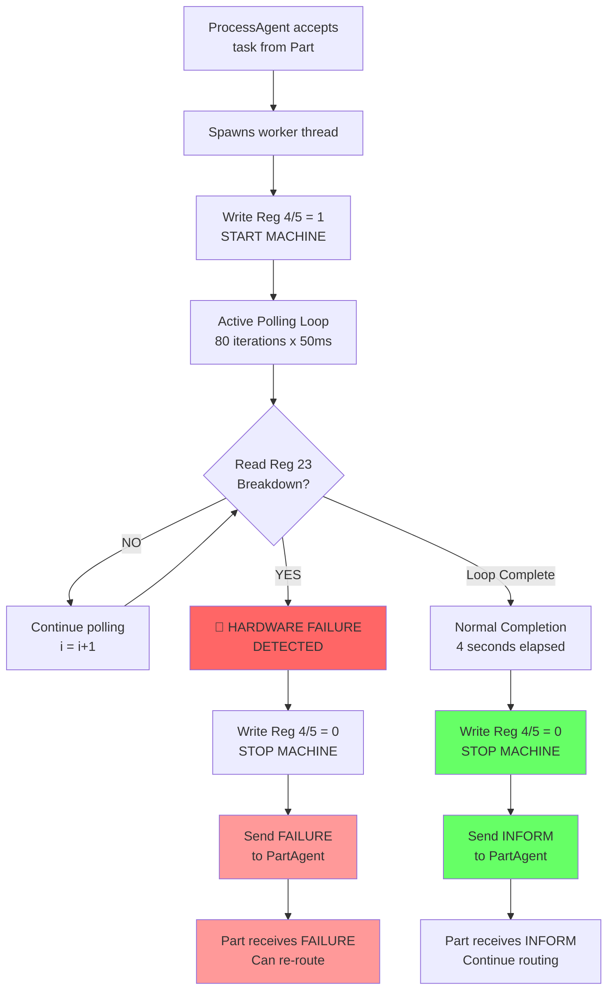
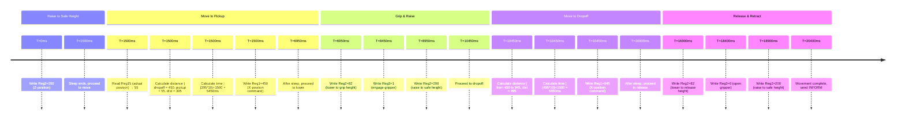
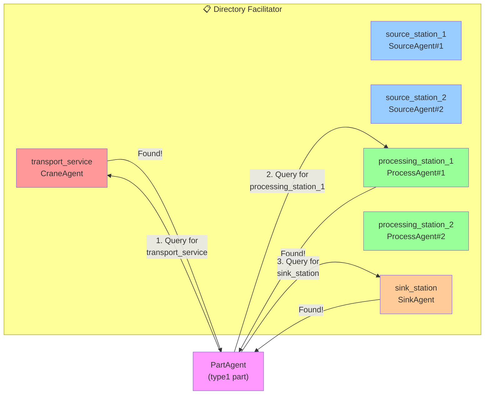

# Architecture Diagram - Visual Representation

## System Overview (Mermaid Diagram)



---

## Part Lifecycle (Mermaid Diagram)



---

## Configuration-Driven Discovery (Mermaid Diagram)



---

## Hardware Failure Detection Flow (Mermaid Diagram)



---

## State Machine - RouteExecutionBehaviour (Mermaid Diagram)

```mermaid
stateDiagram-v2
    [*] --> STATE0
    
    STATE0: STATE 0: Query DF<br/>for next service
    STATE0 --> CheckQueue{Process plan<br/>empty?}
    
    CheckQueue -->|YES| STATE3: Continue to<br/>STATE 3
    CheckQueue -->|NO| GetService{Service<br/>found?}
    
    GetService -->|NO| Wait["Block 2 seconds<br/>& retry"]
    Wait --> STATE0
    
    GetService -->|YES| STATE1
    
    STATE1: STATE 1: Initiate<br/>Contract Net
    STATE1 --> Ready["Add PartNegotiator<br/>behavior"]
    Ready --> STATE3
    
    STATE3: STATE 3: TERMINATE
    STATE3 --> Cleanup{Plan<br/>empty?}
    
    Cleanup -->|YES| Callback["negotiationFinished()<br/>callback"]
    Callback --> UpdateState["Update:<br/>isAtDestination flag<br/>processPlan queue"]
    UpdateState --> STATE0
    
    Cleanup -->|NO| Exit["doDelete()<br/>Agent lifecycle end"]
    Exit --> [*]
    
    note right of STATE0
        If not at destination: Search for Crane
        If at destination: Search for Machine
    end note
    
    note right of STATE1
        Send CFP with appropriate content
        Depending on isAtDestination flag
    end note
    
    note right of Callback
        Called by PartNegotiator
        when service completes
    end note
```

---

## Modbus Register Timeline (Mermaid Diagram)



---

## System Deployment View (Mermaid Diagram)

```mermaid
C4Context
    title: Manufacturing Cell - Deployment Context
    
    Person(User, "AI Planner / Operator", "External system")
    
    System_Boundary(MES, "Manufacturing Cell") {
        System(JADE_Platform, "JADE Platform", "Multi-agent system with:<br/>- Directory Facilitator (DF)<br/>- 6 core agents<br/>- Dynamic part spawning")
        
        Ext_System(Config, "factory_layout.json", "Hardware configuration")
        Ext_System(NetworkIface, "Modbus TCP", "Hardware control interface")
    }
    
    Ext_System(PLC, "PLC / Simulator", "Physical/simulated hardware:<br/>- Crane with X/Z control<br/>- 2 Processing stations<br/>- Part sensors<br/>- Breakd down button")
    
    Birel(User, JADE_Platform, "REST API<br/>POST /spawn<br/>(type1 or type2)")
    Birel(Config, JADE_Platform, "Read on startup")
    Birel(JADE_Platform, NetworkIface, "Read/Write Modbus<br/>Registers 1-23")
    Birel(NetworkIface, PLC, "TCP/IP<br/>127.0.0.1:502")
    Birel(User, PLC, "View/Control<br/>(optional)")
    
    UpdateRelStyle(JADE_Platform, Config, $textColor=green, $lineColor=green)
    UpdateRelStyle(JADE_Platform, NetworkIface, $textColor=blue, $lineColor=blue)
```

---

## Service Discovery (Mermaid Diagram)




